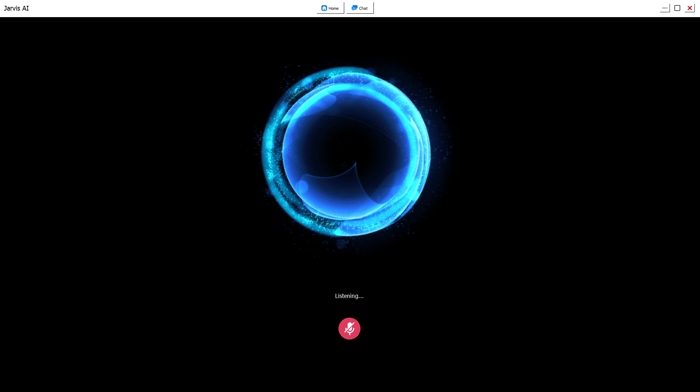

# 🤖 Jarvis AI Assistant

A powerful, voice-controlled AI assistant with advanced automation capabilities, built with Python and PyQt5.

<div align="center">
  
  <p><em>🎙️ Voice-controlled AI assistant with beautiful animated interface</em></p>
</div>


## 🌟 Features

### 🎯 **Core Capabilities**

- **Voice Recognition** - Hands-free operation with speech-to-text
- **Text-to-Speech** - Natural voice responses
- **Smart Decision Making** - AI-powered command categorization using Cohere
- **GUI Interface** - Modern PyQt5 chat interface

### 🔧 **Automation & Control**

- **System Commands** - Volume control, shutdown, mute/unmute
- **Application Control** - Open/close apps, web automation
- **Web Search** - Google search with real-time results
- **YouTube Integration** - Search and play videos

### ⏰ **Reminder & Timer System**

- **Set Reminders** - "Remind me to call mom at 5:30 PM"
- **Timer Functions** - "Set a timer for 5 minutes"
- **List Management** - View active reminders and timers
- **Persistent Storage** - Data saved across app restarts
- **Background Notifications** - Voice alerts when time is up

### 🎨 **AI Image Generation**

- **Text-to-Image** - Generate images from descriptions
- **Stable Diffusion** - High-quality AI art using Hugging Face API
- **Auto-Display** - Generated images open automatically
- **Organized Storage** - Images saved in `Data/Generated_Images/`

### 💬 **Chat & Search**

- **Conversational AI** - Natural language conversations
- **Real-time Search** - Up-to-date information retrieval
- **Chat History** - Persistent conversation logs

### 🐳 **Docker Support**

- **Portable Deployment** - Run anywhere with Docker
- **GUI & Headless Modes** - Flexible deployment options
- **Cross-platform** - Windows, Linux, Mac compatibility

## 🚀 Quick Start

### 1. **Clone Repository**

```bash
git clone https://github.com/Developer-Tanay/Jarvis-Assistant.git
cd Jarvis-Assistent
```

### 2. **Install Dependencies**

```bash
pip install -r Requirements.txt
```

### 3. **Configure Environment**

Create a `.env` file in the root directory:

```env
# Required API Keys
COHERE_API_KEY=your_cohere_api_key_here
HUGGINGFACE_API_KEY=your_huggingface_api_key_here
GROQ_API_KEY=your_groq_api_key_here

# Personal Settings
USERNAME=YourName
ASSISTANT_NAME=Jarvis
INPUT_LANGUAGE=en
ASSISTANT_VOICE=David
```

### 4. **Run Application**

```bash
python Main.py
```

## 🔑 API Keys Setup

### **Cohere API** (Required)

1. Visit [Cohere.ai](https://cohere.ai)
2. Sign up for free account
3. Get API key from dashboard
4. Add to `.env` file

### **Hugging Face API** (For Image Generation)

1. Visit [Hugging Face](https://huggingface.co)
2. Create account and get access token
3. Add to `.env` file

### **Groq API** (Optional - Enhanced Performance)

1. Visit [Groq](https://groq.com)
2. Sign up and get API key
3. Add to `.env` file

## 🎮 Usage Examples

### **Voice Commands**

#### **Reminders & Timers**

```
"Jarvis, remind me to call mom at 5:30 PM"
"Set a timer for 10 minutes"
"What are my reminders?"
"Show my active timers"
```

#### **Image Generation**

```
"Generate an image of a sunset over mountains"
"Create a picture of a cute robot"
"Make an image showing a futuristic city"
```

#### **System Control**

```
"Mute my computer"
"Unmute"
"Shutdown computer"
```

#### **Web & Search**

```
"Search Google for Python tutorials"
"Play relaxing music on YouTube"
"What's the latest news about AI?"
```

#### **General Chat**

```
"Hello Jarvis, how are you?"
"Tell me a joke"
"What's the weather like?"
```

## 📁 Project Structure

```
Jarvis-Assistent1/
├── Main.py                 # Main application entry point
├── Requirements.txt        # Python dependencies
├── .env                   # Environment variables (create this)
├── README.md              # This file
├── Backend/               # Core AI and automation modules
│   ├── Model.py          # Decision-making AI (Cohere)
│   ├── Automation.py     # Command execution
│   ├── ReminderTimer.py  # Reminder/timer system
│   ├── ImageGeneration.py # AI image generation
│   ├── Chatbot.py        # Conversational AI
│   ├── SpeechToText.py   # Voice recognition
│   ├── TextToSpeech.py   # Voice synthesis
│   └── RealtimeSearchEngine.py # Web search
├── Frontend/              # User interface
│   ├── GUI.py            # PyQt5 interface
│   └── Files/            # GUI data files
├── Data/                  # Application data
│   ├── ChatLog.json      # Chat history
│   ├── reminders.json    # Active reminders
│   ├── timers.json       # Active timers
│   └── Generated_Images/ # AI-generated images
└── Docker/               # Containerization
    ├── Dockerfile
    ├── docker-compose.yml
    └── run-docker.sh
```

## 🐳 Docker Deployment

### **Quick Docker Setup**

```bash
# Build and run
docker-compose up --build

# Headless mode (no GUI)
docker-compose --profile headless up jarvis-headless
```

### **Windows Docker**

```batch
# Use provided script
run-docker.bat build
run-docker.bat headless
```

## 🔧 Configuration

### **Voice Settings**

Edit `.env` file:

- `INPUT_LANGUAGE` - Recognition language (en, es, fr, etc.)
- `ASSISTANT_VOICE` - TTS voice name

### **GUI Customization**

Modify `Frontend/GUI.py` for:

- Theme colors
- Window size
- Chat appearance

### **Command Extensions**

Add new commands in:

- `Backend/Model.py` - For command recognition
- `Backend/Automation.py` - For command execution

## 🛠️ Dependencies

### **Core Libraries**

- `PyQt5` - GUI framework
- `python-dotenv` - Environment variables
- `cohere` - AI decision making
- `requests` - HTTP requests
- `keyboard` - System control

### **Audio & Speech**

- `pygame` - Audio playback
- `edge-tts` - Text-to-speech
- `speech_recognition` - Voice input

### **Web & Automation**

- `selenium` - Web automation
- `beautifulsoup4` - Web scraping
- `googlesearch-python` - Search integration

### **Image Generation**

- `Pillow` - Image processing
- `requests` - API communication

## ⚡ Performance Tips

1. **API Response Times**

   - Cohere: ~1-2 seconds
   - Image Generation: ~10-30 seconds
   - Voice Recognition: ~2-3 seconds

2. **Resource Usage**

   - RAM: ~200-400MB
   - CPU: Low usage except during image generation

3. **Optimization**
   - Use Docker for consistent performance
   - Close unused applications for better voice recognition
   - Ensure stable internet for API calls

## 🐛 Troubleshooting

### **Common Issues**

#### **Voice Recognition Not Working**

```bash
# Check microphone permissions
# Ensure pygame is installed
pip install pygame
```

#### **API Errors (403/401)**

- Verify API keys in `.env` file
- Check API key permissions
- Ensure internet connectivity

#### **Image Generation Fails**

- Confirm Hugging Face API key
- Try free model: `runwayml/stable-diffusion-v1-5`
- Check network connection

#### **GUI Not Loading**

```bash
# Install PyQt5
pip install PyQt5
```

#### **Docker Issues**

- Ensure Docker Desktop is running
- Use headless mode on Windows
- Check volume mounts for data persistence

### **Debug Mode**

Enable detailed logging by adding to `.env`:

```env
DEBUG_MODE=True
```

## 🔒 Security Notes

- **API Keys**: Never commit `.env` file to version control
- **Local Data**: All conversations stored locally in `Data/`
- **Network**: Only communicates with specified AI APIs
- **Permissions**: Requires microphone access for voice features

## 🚀 Future Enhancements

- [ ] Multi-language support
- [ ] Custom wake word detection
- [ ] Integration with smart home devices
- [ ] Advanced image editing capabilities
- [ ] Calendar integration
- [ ] Email automation
- [ ] Mobile app companion

## 📄 License

This project is licensed under the MIT License - see the LICENSE file for details.

## 🤝 Contributing

1. Fork the repository
2. Create feature branch (`git checkout -b feature/amazing-feature`)
3. Commit changes (`git commit -m 'Add amazing feature'`)
4. Push to branch (`git push origin feature/amazing-feature`)
5. Open Pull Request

## 📧 Support

For issues and questions:

- Open GitHub issue
- Check troubleshooting section
- Review API documentation

---

**Made with ❤️ for AI automation enthusiasts**
